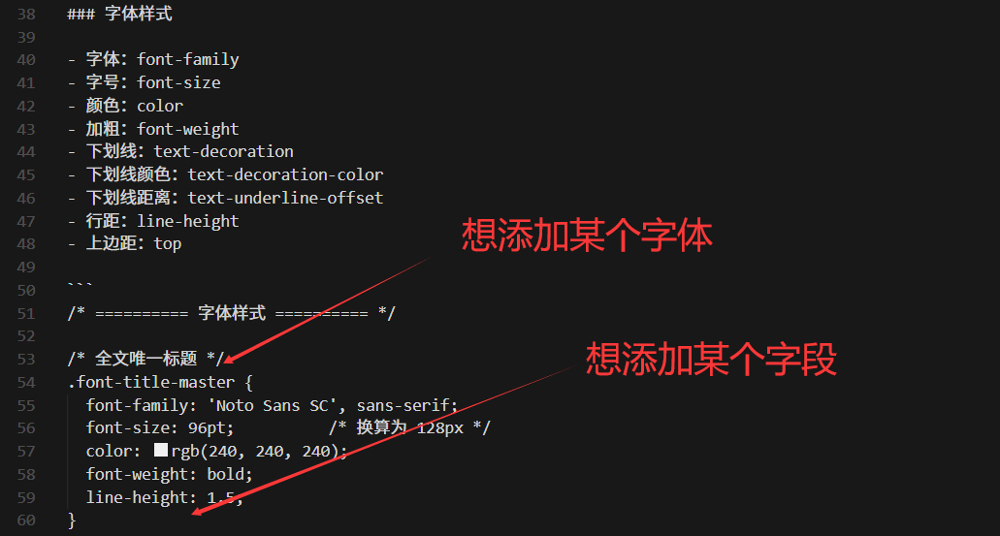
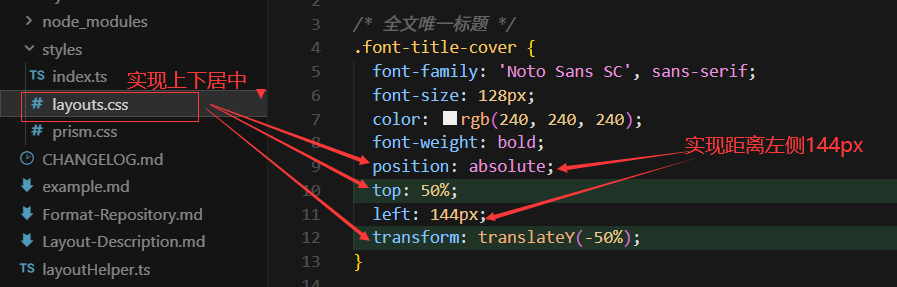
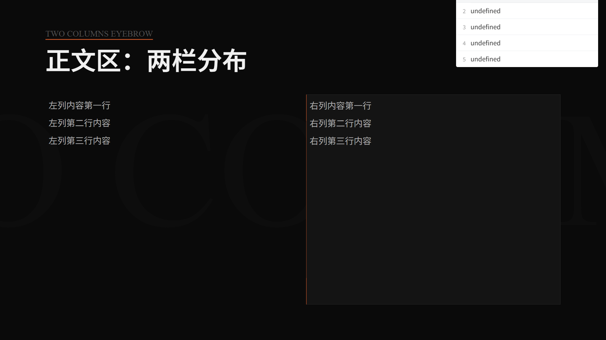
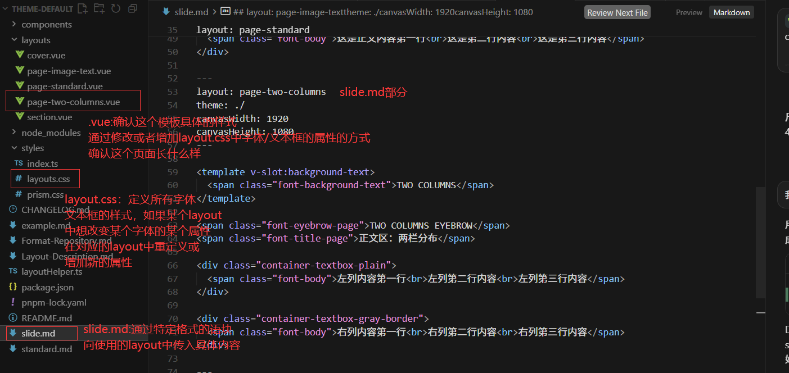
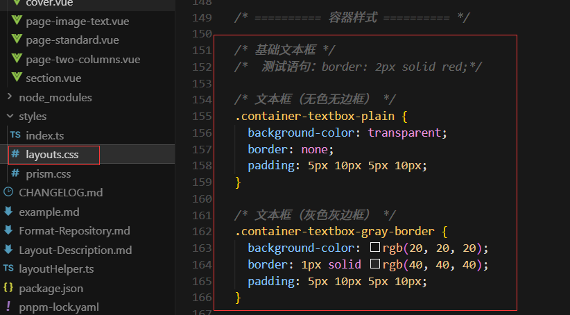
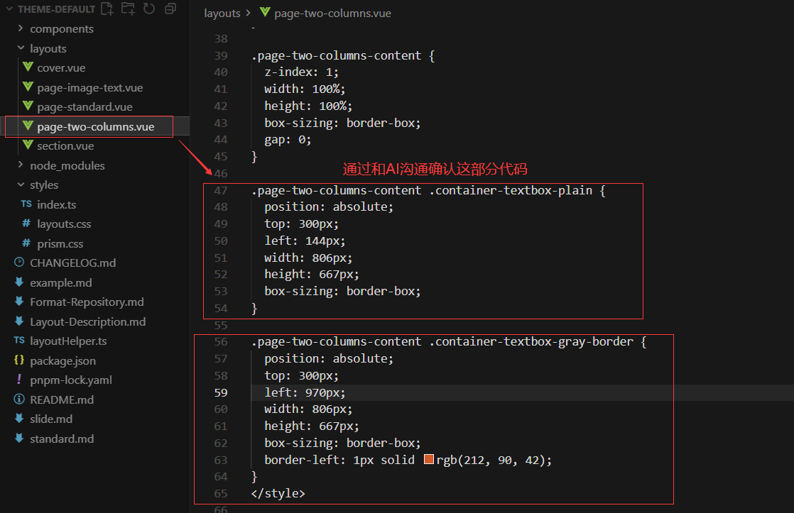
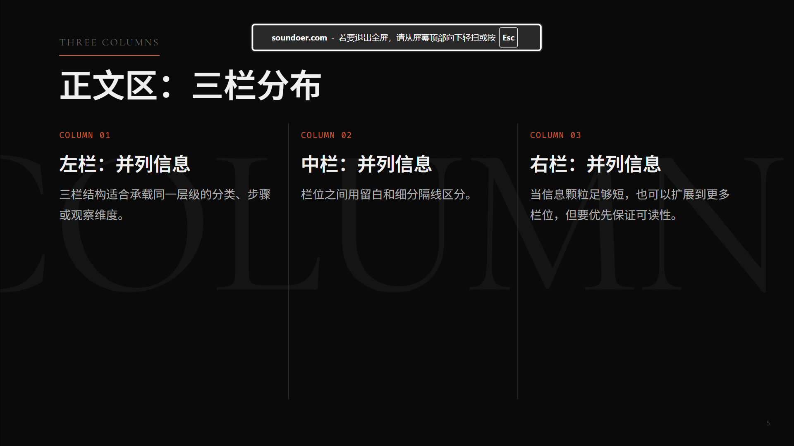
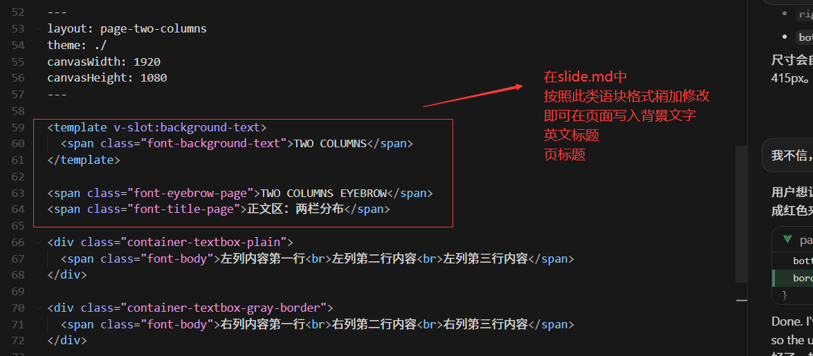
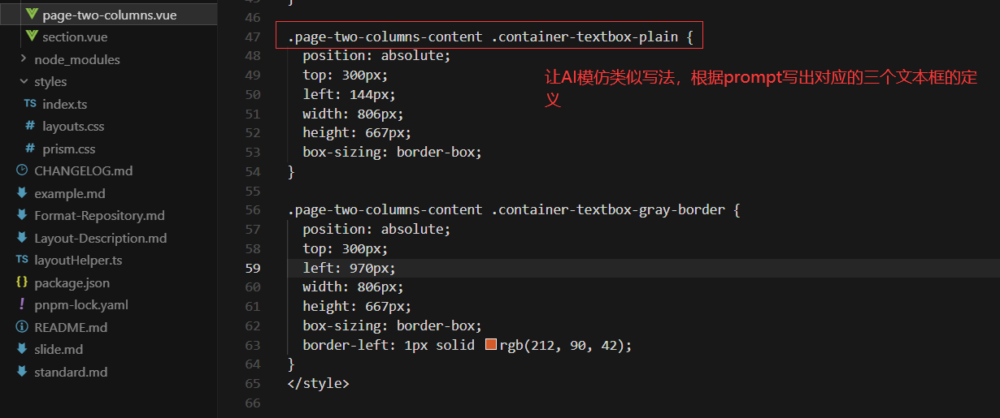

# Build-GAD-Slidev-Layout-Example

作业提交前备注(2026/06/02/15时20分)：

由于经历了大量的调试和学习，在2026.6.2这天形成稳定比较稳定的框架的时候

再回看此前写的文章很多东西已经是错的或者说落后的了

在此推翻重写，介绍最终的稳定的方案和过程中使用的一些错误的方法

本文探讨如何通过下列工具，对课堂上老师所使用的Slidev Theme进行复刻。并研究如何与Cursor协作，基于现有Slidev Theme制作汇报所用Slide

使用工具列表：

- Snipaste(免费，轻量截图软件)

- PPT,Excel(用于采集，记录数据)
- 字由(识别Slidev Layout Example中出现的字体)

- NPM，PNPM(包管理器)
- Cursor(开发和制作Slide)

## 需求分析与方案研究

核心需求是：采集Slidev Layout Example中的：

- 属性类
  - 各类字体，字号，颜色
- 距离类
  - 各类固定位置的字体其距离页面顶部，底部的距离
  - 各类容器其尺寸与距离页面顶部，底部的距离

字体，颜色的采集比较简单，前后方案没有大的变化

- 字体的采集只需截图，上传至[字由AI](https://www.hellofont.cn/font-ai)识别即可
- 颜色的采集用QQ自带截图即可，指针放到某个位置会显示其RGB值

核心在于字号，距离的采集

**在此先介绍重写前采用的比较低效/错误的方案：**

- 先用Snipaste把Slidev Layout Example中的所有的页面截取下来，统一导进一个PPT，作为每一页的背景图片（这个PPT的宽需要设置为50.8cm高设置为28.57cm）。
- 在PPT里创建文本框，例如想采集总标题的字号，就创建一个文本框，先把字体调整为识别出的字体，不断调他的字号，直至匹配背景图片。记录这个字号
- 如果想采集距离，就创建一个文本框，拿他的上边框对齐想要测的位置，读取对应的上/左边距读数，记录

最后记录的数据总结到一个.xlsx,然后由于AI无法直接读取.xlsx,还需要通过包管理器下载.xlsx转.txt的文件才能让AI读取到这些数据

并且以上采集到的字号数据是pt,距离数据是cm,他们的数值会受到ppt页面尺寸的影响

后续转为Slidev使用的.css中时，统一需要转为px

需要考虑十分复杂的尺寸转换才能确保数据的正确

总结下来，雷点如下

- 经历复杂单位转换（pt,cm统一转px）
- 文件格式转换(ppt,xlsx到txt)
- 编写prompt时需要精准描述，十分复杂，容易出错

在尝试过程中，我还尝试了以下方案

- 专门创建一个.md代替xlsx记录数据
- .md里写.css格式的代码供cursor参考，例如后续想添加某个字体，在这个.md中添加对应的css字段，例如下图

- 在cursor里编写一个prompt文档，告诉AI如何读取，使用上述的.md文件

**2025.6.2最终方案**

经历了一系列复杂的踩雷，主要做出以下改进

- 针对距离采集：直接在网页中使用QQ自带截图截取距离即可，获取的单位直接为px，不用经历复杂的字号转换
- 舍弃上述所说的专门使用一个.md文件去记录数据，再编写prompt处理这些数据
- 一切数据直接写为.css文件

- 针对字号采集(pt转px),可以用一个测试页面尝试，不断调整px，至看起来和原页面

对于一个完全的新手来说可能完全不知道什么是CSS，如何写.css文件

但是完全不困难，经历了和AI几轮的沟通，重建项目后，以及稍微的学习过后，所有想要的数据完全可以直接直接写成.css代码

例如:当需要实现让总标题上下居中，距离页面左部144px时

可以省去数据转换，省去编写prompt处理数据转换

也能加深对项目的理解

## 项目实现

此前的文档里写了很多如何编写prompt告诉cursor如何创建这样一个slidev的theme

但是经历一系列调试

其中很多语句已经失效，不需要了

在此简要介绍整个项目的大概的实现，以`正文区：两栏分布`为例

其主要由三个部分的内容构成：

- page-two-columns.vue

- layout.css

- slide.md

对于每个文本框，只在layout.css中定义了一些很基础的属性。

位置，尺寸都是没有定义的

而在两栏分布的布局中，我通过告诉AI我测量得出的一些数据，让它帮我重写对于两栏分布这个layout其中的两个文本框，其尺寸，位置应该是什么

## 后续拓展

限于时间实在是无法再做更加详细的介绍，也还没有研究到如何把素材喂给它让它生成出具体的Slide

在此简单阐述实现项目中还未实现的三栏分布的思路

首先，对于左上方的英文标题和页标题，以及背景英文字由于他们在每一页的样式位置都是一样的

直接在slide.md文件中以特定语块写入他们即可

核心在于其中三栏，可以把他们理解为三个文本框

在创建对应layout时，只需跟AI描述：

> 在创建page-three-columns.vue时，我希望创建三个文本框，他们尺寸相等，顶端对齐，在页面中按从左到右排列。每个文本框之间相距2px.最左边的文本框距离页面? px,最右边的文本框距离页面？ px，三个文本框距离顶部？ px ,距离底部？ px
>
> 左边，中间的文本框的右框线为rgb(x,x,x)颜色

通过一系列描述

最后在slide.md中通过特定语块向各个文本框插入相关内容即可

注意，.vue中其余内容均套用先前模板

## 总结

最难的部分是从0到1，学会之前不了解的CSS知识，了解slidev的项目结构与工作方式，排除各种bug.确保写的新的代码能准确的实现想要的功能，而不是写的时候上边距是100px边距，渲染出来是200px边距。

比较有趣的一个部分是经过大量实验终于明确了什么属性需要在layout.css中定义，什么需要在每一个不同的layout中拓展。

